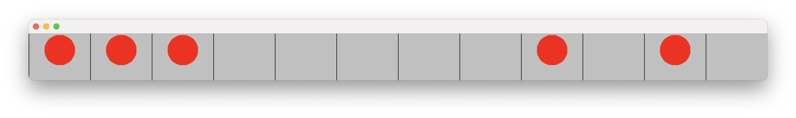

# Lab - The Silver Dollar Game 

## Learning Goals

* Practice some of your new Java programming skills.
* Use the `ArrayList` class before we learn about its implementation in class.
* Gain experience testing for errors and writing code that handles edge cases.


## Key Terms and Concepts
* `ArrayList` - An ArrayList is a resizable array-like data structure, where items can be added and removed regardless of the initialized size. In this lab, we will use the default `java.util.ArrayList` class. Please look into its [documentation](https://docs.oracle.com/javase/8/docs/api/java/util/ArrayList.html) for more details about its methods, specifically its two different constructors, the `add`, `get`, and `size` methods.
* Edge cases - A possible scenario of user input which requires a specific or non-standard response from the code, such as a user clicking out of bounds or attempting an illegal move.
* Inner classes - A class which is a member of another class: basically, nested classes. Different from inheritance. (See [Java documentation](https://docs.oracle.com/javase/tutorial/java/javaOO/innerclasses.html)).
* `EventListener` - A method in code that waits for an event to occur, such as a key press or mouse click, before triggering a response (See  [Java documentation](https://docs.oracle.com/javase/tutorial/uiswing/events/intro.html)).


## Silver Dollar Game - Text-based version

Your program for lab today is to write first a text-based version of the Silver Dollar Game. (There is also a graphical version, but it was for when the labs were 3 hours long. There is no expectation nor need to complete the graphical version unless you would really like to in your own free time.)

You are given a strip with a certain number of squares and a smaller number of coins that are randomly allocated throughout those squares and each square can have at most one coin. 

Your objective is to move all the coins to the left side. Coins can be moved multiple squares at a time, and only to the left. Coins cannot "jump" over each other, nor can they occupy the same square as another coin. The coins start in random positions along the strip. The game is over when all the coins are next to each other starting in the far left square.

Make sure you understand how the game is played before coding it up! This is a time for discussion in the lab; do not hesitate to ask questions or share your thoughts with your classmates and the staff.

The behavior, in the text-based version, will look like this:

```
   _o____oo_oo_ Next move? 6 4
   _oo____o_oo_ Next move? 2 2
   Illegal move!
   _oo____o_oo_ Next move? 1 1
   o_o____o_oo_ Next move?
   ...
   ooooo_______ You win!!
```

The pair of numbers after `Next move?` signifies the starting location of a coin and the number of squares that the coin is to move to the left. To be consistent with how we do indexing in Java the leftmost square is in location 0, not 1.

For the first part of this lab, we have given you a start on the code for the class `TextCoinStrip`. Take some time to understand the code (we promise you’ll be much better off spending 5-10 minutes looking at the code before doing any coding yourself).
   
Start by looking at the constructor. What can you do with the parameters `coins` and `squares`? Instance variables can be handy, although the size of the textCoinStrip carries implicitly the information about the number of squares.

Then continue by filling in the four missing methods.

1. `toString` which returns the string representation of the strip,
2. `isLegalMove` which determines if a move is legal,
3. `makeMove` which makes a (legal) move, and
4. `gameIsOver` which determines if the game is completed.

Note that the program will not execute at all until the methods that are supposed to return something have been filled. If you want to get rid off the errors as you tackle one method at a time, you can write placeholder return statements, like `return false`, until you get the other methods working.

## Hints/Advice

* Develop incrementally.  Write one method and test that it works by writing static test methods (either in the class or in a separate class).  Make sure that method is working as you expect before moving on to the next method.  To get in good habits, you should also be pushing your changes to github once you have one method working with a clear commit message (like "toString working").
* Think about all of the possible ways that your methods could be called and make sure that you are handling all of the cases appropriately.  One of the goals of this class is to get used to testing your own code in more realistic settings, i.e., where the inputs might not always be "proper" inputs.
* There are many constraints on whether or not a move (starting point and distance) is
legal.  You should think about these and enumerate them (in the pre-method comment) before
trying to write the code for the `isLegalMove` method. Can you find 4?


## Submitting your work

Make sure that you change the `@author` comment at the start of each file to include your own name and commit and push regularly. Make sure to remove the TODO comments.

When ready, submit your work to Gradescope. We have made a subset of the tests we will use available so you can test your code partially but you should think beyond our tests.

## The Silver Dollar Game - Beyond the text version: OPTIONAL

You may work on a graphical version of the game you just implemented. In this version of the game, the user will use the mouse to move the coins instead of typing commands on the keyboard. Your game must respond correctly to any and all forms of user input, never allowing the rules or structure of the game to be broken.

Be sure to read over the entirety of the remaining document and the code, including the classes already implemented for you, before beginning work on the code for this portion of the lab. This will help you better understand the tools provided and the parameters required for this project.

`Coin` and `CoinSquare` have already been implemented for you. You are responsible for `GraphicsCoinStrip`, which has been partially implemented. We've added TODO statements where you need to edit the code (there are four places). If you end up pursuing this direction, please message the instructor or stop by OH for solutions. 

## Classes


What the GUI should look like, where the red circles are randomly placed coins.

### `Coin`
The `Coin` class represents a single coin. This class is already implemented for you. This class contains several useful methods for creating and moving the coin, which will be useful for the assignment. Make sure to read its code!

Note that the `Coin` constructor requires a `JFrame` (a drawable panel
on the screen) as a parameter.  The primary (`GraphicsCoinStrip`) class 
in this project extends the `JFrame`, and so (`this`) can be passed
as the required `JFrame` when the new coins are constructed if you are within the `GraphicsCoinStrip` class.

### `CoinSquare`
The `CoinSquare` class represents a square. This class is already implemented for you and contains methods to interact with and gain information about the coin contained in a square. Again, these methods are useful for the assignment and it will be very helpful to understand them before beginning the assignment.

### `GraphicsCoinStrip`

The `GraphicsCoinStrip` class uses the `Coin` and `CoinSquare` classes to implement the Silver Dollar Game. This class is partially implemented. There are TODO comments where you need to add code. Both `Coin` and `CoinSquare` have a `contains` method that takes an `x` and `y` and returns a `boolean` indicating if the `x,y` location is within them (there are inherited from `Ellipse2D` and `Rectangle2D`, respectively).

Notice that there are no `play` or `move` methods in the `GraphicsCoinStrip` class because the mouse is in control of the game. Much of what drives the game is the mouse event handling which can be found in the inner class `CoinMouseListener` inside the `GraphicsCoinStrip` class. The purpose of the inner class `CoinMouseListener` is to encapsulate all of the methods that deal with the mouse movement.

You can add whatever methods you think would be useful to the `GraphicsCoinStrip` or `CoinMouseListener` classes, but do not change the names of any of the existing methods or variables.

After you have a working copy of the game, fill in the `gameIsOver` method in this class that checks to see if the game is over and, if so, use this method to signal this to the user in some fashion. Possible examples are to print out a message to the console, or better, change the color of all of the coins. You can also make sure that the coins no longer move once the game is completed (although this is not required). Test this program rigorously to make sure that it works consistently, even when the user attempts unusual or unexpected actions.

**Note**: Make sure that you do not "hard-code" your solution to the specific number of coins and strip positions we have given you. Your code should work for any strip size and any number of coins.


## Grading

For grading purposes, you will be graded on the text-based version of the game based on the following criteria. If you implement the graphical version and get checked off, you will get small amount of extra credit for this lab.

| Criterion                                         | Points |
| :------------------------------------------------ | :----- |
| Four methods filled out correctly                 | 1      |
| Game carries out properly                         | 1      |
| Style points, committing regularly, exit ticket    | 1      |
| **Total**                                         | 3     |

This week's exit ticket can be found [here](https://docs.google.com/forms/d/e/1FAIpQLSfrvq3wt2_I8MzdTbptXU9MQGwHiUmx1HnWIpVuHtprs9s-lg/viewform?usp=sharing&ouid=101766829093165321512).

## Credits
This lab is adapted from the [Data Structures textbook, section 3.10](https://www.cs.williams.edu/~bailey/JavaStructures/Book_files/JavaStructures.pdf). If you would like additional practice, check out the "thought questions" they list at the end of the lab. 